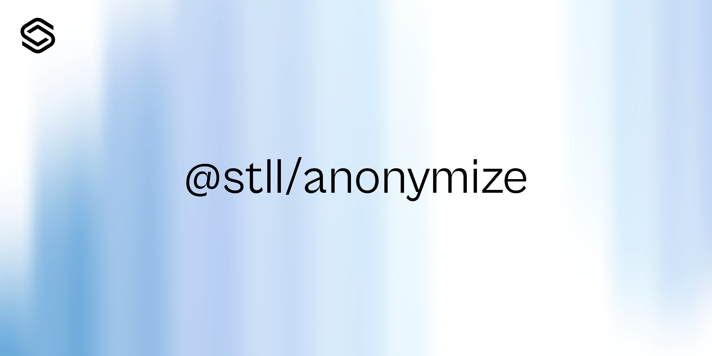

<p align="center">
  
</p>

# anonymize

Monorepo for the Stella anonymization stack.

It contains the runtime package, the published data package, and the browser/WASM entrypoint used by downstream apps.

## Packages

| Package | Purpose |
| --- | --- |
| `@stll/anonymize` | Native runtime for multi-layer PII detection and anonymization |
| `@stll/anonymize-data` | Published deny-list dictionaries and trigger/config data |
| `@stll/anonymize-wasm` | Browser/WASM build of the runtime |

## Install

```bash
bun add @stll/anonymize
# Optional runtime data bundle
bun add @stll/anonymize-data
# Browser / Vite usage
bun add @stll/anonymize-wasm
```

## What it does

- Regex-based detection for common identifiers, dates, and legal entities
- Trigger phrases and deny-list matching for language-aware anonymization
- NER, coreference handling, and confidence boosting
- Native, browser, and Vite-compatible entrypoints

## Development

```bash
bun install --frozen-lockfile
bun run lint
bun run typecheck
bun run test
```

## Release hygiene

- Pinned GitHub Actions workflows validate lint, typecheck, tests, and package tarballs before release.
- The data package tarball is checked to make sure every exported dictionary path is present.
- Release publishing is gated behind manual workflow dispatch and provenance-enabled npm publish steps.

## Repository layout

- [`packages/anonymize`](packages/anonymize)
- [`packages/data`](packages/data)
- [`packages/anonymize/wasm`](packages/anonymize/wasm)
